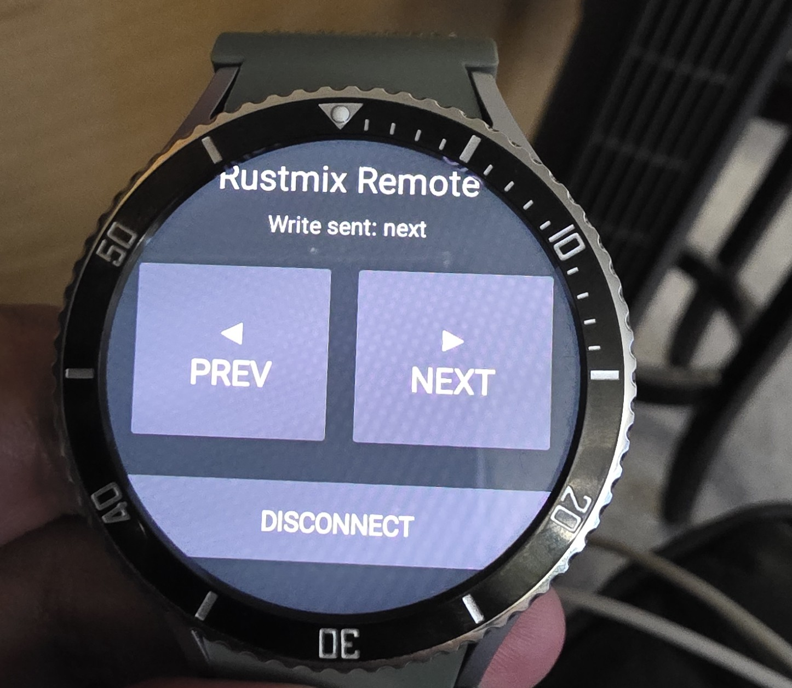
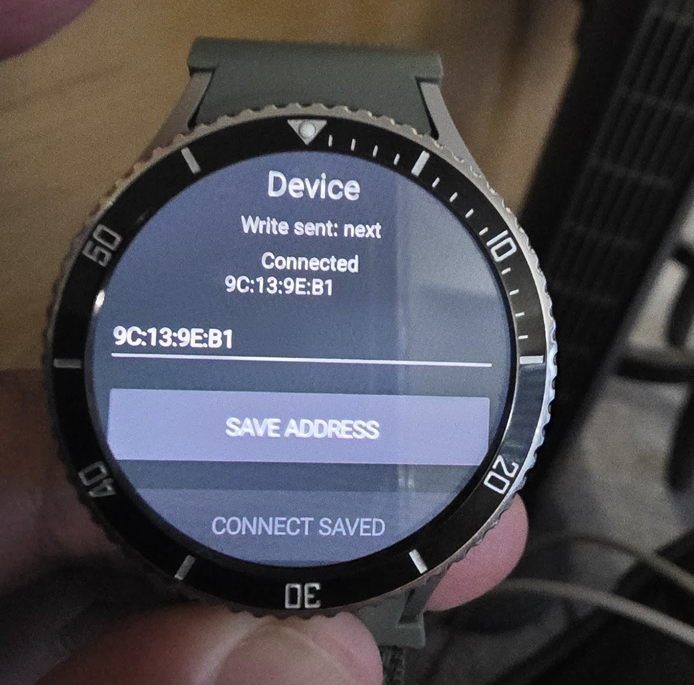

# Rustmix Remote

Rustmix Remote is a Wear OS smartwatch app for controlling Rustmix e-paper firmware devices.

The first targets are:

- Rustmix-Wave on the Waveshare ESP32-S3 3.97-inch e-paper device
- rustmix-x4-firmware on the Xteink X4

Rustmix Remote intentionally stays separate from the Vaachak platform. It is firmware-native and optimized for devices where the Rustmix firmware controls both sides of the input model.

## Protocol direction

Rustmix Remote uses a custom BLE GATT protocol instead of generic Bluetooth HID.

```text
Wear OS watch
    ↓ BLE GATT command write
Rustmix firmware BLE remote service
    ↓
RemoteEvent queue
    ↓
Existing reader/navigation event handling
```

## Goals

- Page next / previous from a smartwatch
- Back, menu, select, and scroll navigation
- Reader-friendly haptic feedback
- Low-power BLE command path
- Rustmix-Wave first, X4 second
- No Vaachak branding or Vaachak platform dependencies

## Non-goals

- Boox support
- Android phone/tablet support
- Kobo support
- Generic HID keyboard mode
- Cloud sync
- Phone companion app

Those belong in a separate Vaachak-focused app.

## Status

Initial architecture and app skeleton.

<!-- RUSTMIX_REMOTE_V1_START -->

## Rustmix Remote v1.0.0

Rustmix Remote is a Wear OS Bluetooth remote for Rustmix reader devices. The v1.0.0 release is validated with the Waveshare ESP32-S3 3.97-inch e-paper device running the Rustmix-Wave BLE feature firmware.

### Validated hardware

- Watch: Samsung Wear OS watch
- Reader device: Waveshare ESP32-S3 3.97-inch e-paper device
- Firmware: Rustmix-Wave with `rustmix-remote-ble` feature enabled
- Transport: BLE GATT
- Protocol: Rustmix Remote BLE Protocol / RRBP

### Screenshots

Remote screen:



Device screen:



### Accepted behavior

- Swipeable two-screen Wear OS UI works.
- Remote screen provides Previous, Next, Disconnect, and Device navigation.
- Device screen provides saved BLE address, Connect Saved, Scan / Fallback, and Remote navigation.
- Direct saved-address fallback works with the accepted Rustmix-Wave BLE MAC.
- TXT reader Previous/Next page turning works.
- EPUB reader Previous/Next page turning works.
- RRBP GATT write path is unchanged from the accepted r1 implementation.

### Connectivity notes

The app attempts BLE scan first. On the validated Samsung Wear OS watch, scan registration succeeds but scan callbacks may not reliably surface the Rustmix-Wave advertisement. For the accepted v1.0.0 workflow, use the Device screen and connect with the saved BLE address.

The validated Rustmix-Wave BLE address ended in `3D:66`. Your device may differ. Check the Rustmix-Wave firmware monitor for a line like:

```
Bluetooth MAC: xx:xx:xx:xx:xx:xx
```

Enter that BLE MAC on the Device screen, tap Save Address, then tap Connect Saved.

### Firmware requirements

Rustmix-Wave must be built with the BLE feature enabled:

```
cd /home/mindseye73/Documents/projects/rustmix-wave

export PATH="$HOME/.cargo/bin:$PATH"
export RUSTFLAGS="${RUSTFLAGS:-} --cfg esp_idf_version_least_5_5_0"

cargo +esp build \
  --release \
  --target xtensa-esp32s3-espidf \
  --features rustmix-remote-ble
```

Flash the firmware ELF:

```
espflash flash --chip esp32s3 --monitor \
  target/xtensa-esp32s3-espidf/release/waveshare-epd397-rust-app
```

Expected firmware logs:

```
rustmix-wave=rustmix-remote-gap event=AdvertisingStarted(Success)
rustmix-wave=rustmix-remote-gatts event=PeerConnected
rustmix-wave=rustmix-remote-gatts event=Write
rustmix-wave=rustmix-remote-command status=enqueued
rustmix-wave=rustmix-remote-event event=page-next route=reader-page
rustmix-wave=rustmix-remote-event event=page-previous route=reader-page
```

### Important firmware boundary

The Rustmix-Wave `rustmix-remote-ble` feature build owns the ESP32-S3 modem. Wi-Fi, NTP, weather networking, and Wi-Fi transfer are intentionally skipped in this BLE feature build. Normal non-BLE Rustmix-Wave builds must continue to preserve Wi-Fi behavior.

<!-- RUSTMIX_REMOTE_V1_END -->

